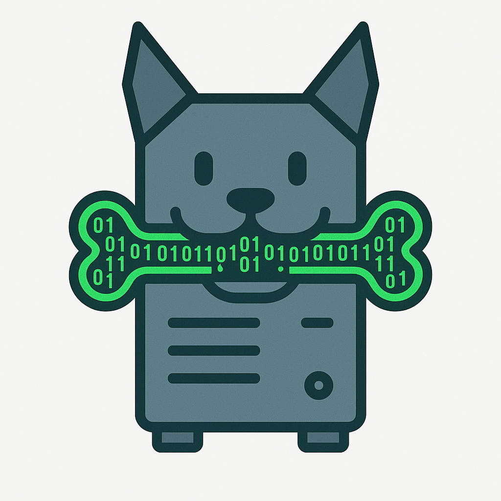

# Packet Feeder

**A treat a day keeps false negatives away.**

Packet Feeder is a tool designed to easily test IDS/IPS systems by replaying PCAP files, modifying IP addresses, running pre‑built scenarios stored in a folder, and even using a step‑by‑step mode that allows reading a PCAP line by line with breakpoints.

This project aims to provide a simple, flexible, and reproducible platform for validating IDS/IPS behavior in different environments.

---

## 🧰 **Project Modes**

Packet Feeder provides multiple operating modes to cover a wide range of IDS/IPS testing needs:

### **1. Classic Replay Mode (tcpreplay‑like)**

Replays a PCAP directly on a chosen network interface, similar to `tcpreplay`. Ideal for:

- Simple tests
- Checking Suricata/Snort rule matches
- Replaying attack PCAPs at full speed or throttled

### **2. Two‑Host Interactive Replay Mode**

In this mode, two VMs (client/server) exchange real packets while the tool replays the PCAP:

- Packets are rebuilt and re‑sent live
- Both machines actually communicate during the replay
- Useful for testing detections that depend on real TCP handshakes, timing, or multi‑step flows

### **3. Scenario Mode (Simple Attack Simulations)**

A collection of small, predefined scenarios, each stored as a folder:

- Single HTTP request
- SSH brute‑force attempt
- DNS or ICMP probes
- Small attack chains

These scenarios allow quick validation of IDS coverage without handling large PCAP files.

### **4. Step‑by‑Step Mode (Breakpoint/Line‑by‑Line)**

Provides complete control over the replay process:

- Process a PCAP packet‑by‑packet
- Add breakpoints at specific packets or protocol layers
- Inspect or modify the live replay sequence
- Useful for debugging, teaching, or reverse engineering detection behavior

---

---

## 🧪 **Testing Lab Used During Development**

To build and validate Packet Feeder, a minimal yet realistic laboratory environment was configured. It runs on a physical server using QEMU/KVM and managed through **virsh**.

### **Lab Architecture**

- **Hypervisor:** QEMU/KVM
- **Management:** virsh
- **Number of VMs:** 2

### **Virtual Machines**

1. **ClearNDR**

   - Role: IDS/IPS (Suricata‑based)
   - Network interface connected to the host's bridge

2. **“Enterprise PC” VM**

   - Role: a simulated workstation inside a corporate network
   - Used as the source to replay PCAP files

### **Lab Network**

- Linux **bridge** on the host (br0)
- Both VMs attached to this bridge
- **Port mirroring** configured:

  - **Ingress + Egress** traffic from the Enterprise PC VM is mirrored to the ClearNDR VM
  - Allows capturing all traffic produced by the PCAP replays

This creates a realistic environment for validating IDS detection capabilities.
